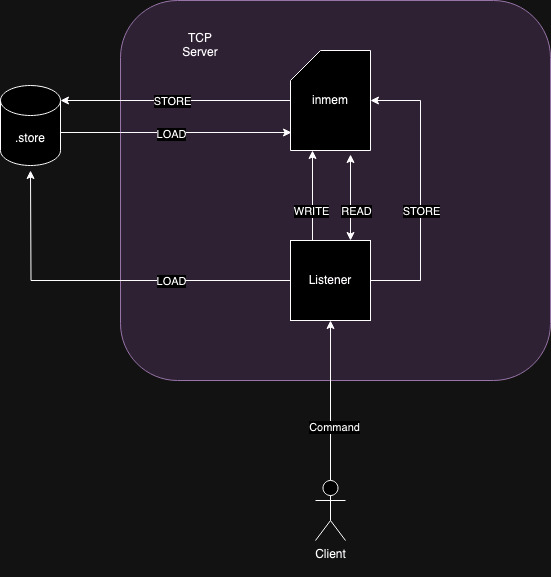

### Bin Store

A store for storing data, using a simple key value pair

#### COMMANDS

##### WRITE [0]

    cache the data in-memory

##### READ [1]

    read from the in-memory map
    *TODO the key right now is the unix time, but this will cause a race condition with more clients writing

##### STORE [2]

    store the in-memory map into a `.gob` file on disk under the `.store` directory

##### LOAD [3]

    load a `.gob` store into memory

##### MERGE [4]

    merges a store on disk with the data in-memory
    * NEED TO IMPLEMENT

- [ ] develop the client so that its better...
- [ ] support multiple store?
  - send the store name in the binary
  - you could use an URN as the key i.e. USER:1234

